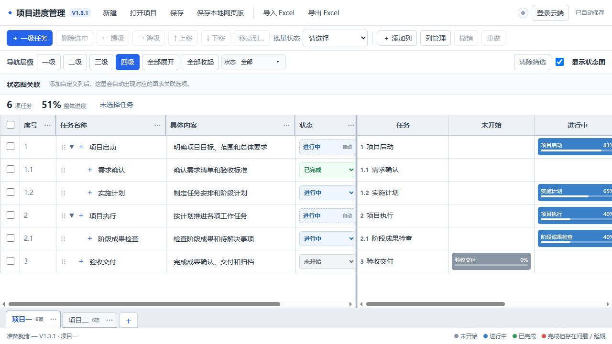

# 项目进度管理 V1.4.1 在线协作版

## V1.4.1 状态图修正

- 右侧取消“未开始、进行中、已完成、完成但存在问题”四个分栏，统一为一列任务进度。
- 右侧每一行与左侧当前显示的任务严格一一对应；隐藏某种状态时保留空行，不破坏上下对齐。
- 状态图提供“未开始、进行中、已完成”三个独立勾选项。
- 默认不显示未开始，默认显示进行中和已完成。
- 延期归入进行中范围并保留红色提示；完成但存在问题归入已完成范围并保留红色提示。

一个面向非程序员的树形项目进度管理网页。它把 Excel 式多项目标签、Word 导航式任务层级、动态表格、状态看板、Excel 导入导出和 Supabase 多人协作放在同一个页面中。

## 在线使用

**正式网站：[立即打开项目进度管理](https://rocstarliu-crypto.github.io/project-progress-manager/)**

无需安装软件。打开网址后可以先在本机使用；需要多人协作时，点击右上角“登录云端”。



## V1.4.0 数据历史与登录历史

- 每次云端保存成功后自动形成一个历史版本，每个项目保留最近 200 个版本。
- 登录并选择云端项目后，顶部显示“历史版本”；可按保存时间查看并恢复。
- 恢复历史时不会删除恢复前的当前版本，因此可以再次恢复回来。
- 云端修改尚未同步时，会同时保存一份本机保护草稿。刷新或重新打开网页后，系统先询问是否恢复，不再直接用云端旧数据覆盖。
- 登录窗口的账号区域新增“登录历史”，显示当前账号最近的登录时间和区域。
- 区域根据设备时区进行简单判断，不使用精确定位。
- 从 V1.3.3 升级时必须在 Supabase SQL Editor 执行 `supabase/v1.4.0-history-login-migration.sql`。

### 本轮问题归因

旧版虽然会立即写入浏览器本地存储，但“等待云端同步”的状态只保存在页面内存中。若在同步完成前刷新或关闭网页，再次登录时会自动载入云端旧快照，从而可能覆盖较新的本机内容。V1.4.0 增加了持久化本机草稿和云端历史版本，分别处理“同步前保护”和“同步后回退”。

## V1.3.3 忘记密码自助恢复

- 登录窗口新增“忘记密码？”入口。
- 用户输入自己的注册邮箱，Supabase 自动发送恢复邮件；系统不会显示该邮箱是否已经注册，从而保护账号信息。
- 用户点击邮件中的恢复链接，会自动回到本网页的“设置新密码”页面。
- 恢复链接建立的临时登录会话会被识别为改密流程，不会再直接进入普通项目页面。
- 用户自行输入并确认新密码后立即生效；项目管理员不参与、不接触也无法查看任何密码。
- 忘记密码时，直接点击“登录云端 → 忘记密码？”，无需联系项目创建者。

## 多项目标签

- 页面仍然只有一套项目进度表格，底部标签用于切换不同项目。
- 默认提供“项目一”和“项目二”两个通用项目管理示例，不包含特定行业内容。
- 点击底部“＋”新建空白项目；点击标签右侧“⋯”可以改名、复制、左移、右移或删除。
- 所有项目共用相同的列结构、列名称和列宽；各项目的任务和单元格内容相互独立。
- 浏览器自动保存全部项目；顶部“保存”和“打开项目”处理整个多项目工作簿。
- 旧版单项目数据会自动成为一个“原项目”标签，不会丢失原任务。

## 主要功能

- 四级任务树：自动编号为 `1`、`1.1`、`1.1.1`、`1.1.1.1`，支持逐级展开、收起、新增、提级、降级、移动和拖拽。
- 父子联动：勾选父任务会选择全部后代；父任务状态和进度根据最末级任务自动计算。
- 默认字段：序号、任务名称、具体内容、状态、进度；每列可独立编辑和拖动列宽。
- 动态自定义列：支持文本、数字、下拉菜单和复选框；新增或改名后同步到全部项目标签。
- 自动关联：新增列后同步出现在表格、顶部筛选区和状态图关联区。
- 五种状态：未开始、进行中、已完成、延期、完成但存在问题，使用下拉菜单修改。
- 四栏状态图：固定展示未开始、进行中、已完成、完成但存在问题；延期任务在进行中栏红色提示。
- Excel：支持 `.xlsx`、`.xls` 导入预览和 `.xlsx` 导出；导入、导出只处理当前项目标签。
- 自动保存：未登录时保存在当前浏览器；登录并选择云端协作项目后同时保存到 Supabase。
- 历史版本：每次云端保存形成版本，可恢复到指定保存时间。
- 未同步草稿保护：刷新或关闭前保留本机草稿，再次进入项目时主动提示恢复。
- 登录历史：当前账号可查看自己的登录时间和按设备时区判断的区域。
- 本地网页版：点击“保存本地网页版”可以生成包含全部项目和数据的独立 HTML 文件。
- 多人协作：每位成员使用自己的账号，通过共享码加入同一个云端协作项目。
- 冲突保护：多人同时保存时不会静默覆盖，可选择云端版本或本机版本。

## 多项目标签怎么用

1. 点击底部标签切换项目。
2. 点击底部“＋”，输入名称并创建空白项目。
3. 点击标签右侧“⋯”打开菜单。
4. “修改名称”只修改标签名称；“复制项目”完整复制任务和内容。
5. “左移、右移”调整标签顺序；删除前系统会确认，并且至少保留一个项目。
6. 在任意项目添加或修改列，其他项目会同步相同列结构，但已有任务内容不会串联。

## 多人协作怎么用

### 第一个人创建云端协作项目

1. 打开在线网站，点击右上角“登录云端”。
2. 使用自己的邮箱注册；如收到确认邮件，点击确认链接后返回登录。
3. 输入云端协作项目名称，点击“用当前页面内容创建”。
4. 点击“复制共享码”，把共享码发给成员，不要共享密码。

### 其他成员加入

1. 打开同一个网址，使用各自邮箱注册并登录。
2. 在“加入已有项目”中输入共享码。
3. 点击“加入并载入”，之后即可共同编辑同一份多项目工作簿。

登录网站的人不会自动看到项目；只有加入相应共享码的账号才能读取数据。

### 忘记密码

1. 点击右上角“登录云端”。
2. 点击“忘记密码？”，填写注册邮箱并点击“发送恢复邮件”。
3. 打开邮箱中 Supabase 发来的恢复邮件，点击其中的恢复链接。
4. 浏览器会回到本网站并自动显示“设置新密码”。输入两次新密码后点击“保存新密码”。

如果未收到邮件，先检查垃圾邮件箱；若系统提示发送频繁，稍等几分钟再试。项目管理员无需也不应向用户索取旧密码。

### 恢复历史版本

1. 登录云端并选择一个协作项目。
2. 点击页面右上角“历史版本”。
3. 找到需要恢复的时间，点击“恢复到此时间”。
4. 确认后，系统把该内容保存为一个新的云端版本。
5. 恢复前的版本不会删除，仍可在历史列表中再次找回。

### 查看登录历史

1. 点击右上角的账号或云端项目按钮。
2. 在“当前账号”右侧点击“登录历史”。
3. 查看当前账号自己的登录时间和区域记录。

## 日常操作路径

- 新增一级任务：顶部“＋ 一级任务”。
- 新增子任务：任务名称左侧“＋”，最多四级。
- 展开当前分支：任务行左侧三角；顶部按钮可统一展开到指定层级。
- 修改内容：直接点击表格单元格。
- 添加字段：点击“＋ 添加列”，输入列名并选择字段类型。
- 调整列宽：拖动表头右侧分隔线，拖动时显示定位线和宽度。
- 筛选任务：使用顶部状态或自定义列筛选；匹配子任务时自动保留父级路径。
- 隐藏状态图：取消勾选“显示状态图”，表格会铺满窗口。
- 备份全部项目：点击“保存”下载 `.gantt` 工作簿。
- 备份当前项目：点击“导出 Excel”。
- 保存离线网页版：点击“保存本地网页版”，或下载仓库中的 `项目进度管理-V1.4.1-本地版.html`。

## 数据与安全

- 云数据库使用 [Supabase](https://supabase.com/)，网页托管使用 GitHub Pages。
- 前端只包含 Supabase 官方允许公开的 publishable key，不包含 `service_role` 私密密钥。
- 数据表启用了 Row Level Security；项目成员只能读取自己已经加入的协作项目。
- 浏览器仍保留本机副本，断网或短暂同步失败不会立即丢失本机数据。
- 重要项目建议定期保存 `.gantt` 工作簿和导出 Excel。

## 技术结构

```text
浏览器 / GitHub Pages
  ├─ 多项目标签与公共列结构
  ├─ 四级任务树、筛选、状态图、Excel
  └─ Supabase Auth + Realtime
       ├─ collaboration_projects
       ├─ collaboration_project_members
       ├─ project_state
       ├─ project_state_history
       └─ user_login_history
```

云端采用“项目快照＋修订号”同步，适合项目管理表格协作；它不是逐字符同时输入的在线文档编辑器。

## 自行部署

1. Fork 或下载本仓库。
2. 在 Supabase 新建项目。
3. 新数据库在 SQL Editor 中执行 [`supabase/schema.sql`](supabase/schema.sql)；旧数据库执行 [`supabase/v1.4.0-history-login-migration.sql`](supabase/v1.4.0-history-login-migration.sql)。
4. 修改 `js/cloud-config.js` 中的 Supabase URL 和 publishable key；不要填写 `service_role` key。
5. 在 Supabase Authentication 的 URL Configuration 中填写自己的 GitHub Pages 地址，并同时把它加入 Redirect URLs；这样确认邮件和“忘记密码”恢复链接才能回到正确网页。
6. 在 GitHub 仓库 `Settings → Pages` 中选择 `Deploy from a branch`，分支选择 `main`，目录选择 `/(root)`。

## 版本

- 当前在线版本：V1.4.1（状态图逐行对应并支持三类勾选；同时增加历史回退、登录历史及未同步草稿保护）。
- V1.3.3 已完整归档在 [`versions/v1.3.3`](versions/v1.3.3)，GitHub 正式网址保持不变。
- V1.3.2 自助密码恢复初版完整保留在 Git 历史中。
- V1.3.1 多项目标签在线协作版完整保留在 Git 历史中。
- V1.3.0 多项目标签本地预览版完整保留在本地交付包中。
- V1.2.1 在线协作版完整保留在 [`versions/v1.2.1`](versions/v1.2.1)。
- V1.2.0 在线协作版完整保留在 [`versions/v1.2.0`](versions/v1.2.0)。
- V1.1.0 本地版完整保留在 [`versions/v1.1.0`](versions/v1.1.0)。
