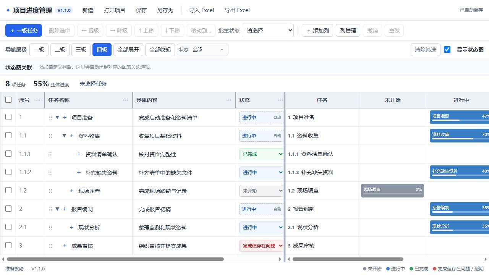

# 项目进度管理网页

一款面向个人和小型项目的轻量级任务进度管理工具。它以四级任务树为核心，将任务名称、具体内容、状态、进度、自定义列和状态图集中在一个页面中，适合项目策划、报告编制、资料收集、成果审核等工作。

[在线打开项目进度管理网页](https://rocstarliu-crypto.github.io/project-progress-manager/)

> 当前版本：V1.1.0。该版本为浏览器本地保存的单机版，不需要注册账号；不同电脑和浏览器之间的数据不会自动同步。多人实时协作版计划在后续版本中提供。



## 主要功能

- **四级任务树**：支持一级至四级任务，自动生成 `1`、`1.1`、`1.1.1`、`1.1.1.1` 树形序号。
- **层级导航**：可以只看一级，或展开到二级、三级、四级，也可以全部展开和全部收起。
- **任务调整**：支持新增子任务、删除、提级、降级、上下移动和跨父任务移动。
- **勾选联动**：勾选父任务时自动选择全部后代；部分子任务选中时父任务显示半选状态。
- **状态管理**：提供未开始、进行中、已完成、延期、完成但存在问题五种状态。
- **父子继承**：父任务状态和进度根据后代自动计算，避免子任务未完成但父任务显示已完成。
- **动态列**：可自行增加文本、数字、下拉菜单和复选框列，并支持改名、隐藏、恢复和删除。
- **自由列宽**：所有默认列和自定义列均可像 Excel 一样拖动调整宽度，设置会自动保存。
- **组合筛选**：状态和自定义列自动进入顶部筛选区；同列多值按“或”，不同列按“且”。
- **四栏状态图**：按未开始、进行中、已完成、完成但存在问题展示任务，延期任务在进行中栏以红色标识。
- **图表关联**：可以使用自定义列进一步筛选状态图，也可以完全隐藏右侧图表。
- **Excel 导入导出**：导出任务数据和列配置；导入前提供预览，错误时保留原数据并指出问题位置。
- **撤销与重做**：删除、移动、提降级、批量修改和导入等操作均支持撤销与重做。
- **自动保存**：任务、动态列、筛选、图表开关和列宽保存在当前浏览器中。

## 快速使用

1. 点击上方的“在线打开项目进度管理网页”。
2. 点击“＋ 一级任务”创建主任务。
3. 点击任务行内的“＋”继续增加下一级子任务。
4. 直接编辑任务名称和具体内容，并通过下拉菜单修改状态。
5. 点击“＋ 添加列”建立负责人、付款状态、结款状态等自定义字段。
6. 使用顶部筛选区查看指定状态、负责人或其他字段对应的任务。
7. 重要数据建议定期点击“导出 Excel”备份。

## 数据保存说明

- 当前数据存放在浏览器本地存储中，刷新页面或再次打开时会自动恢复。
- 清理浏览器网站数据、更换浏览器或更换电脑后，本地数据不会自动跟随。
- 多人打开同一网址时，每个人拥有独立数据，当前版本不会互相覆盖，也不会实时同步。
- 建议通过 Excel 导出文件进行备份或转移数据。

## 项目文件

```text
project-progress-manager/
├─ index.html          网页入口
├─ style.css           页面样式
├─ app.js              任务、筛选、图表和数据逻辑
├─ xlsx.full.min.js    Excel 导入组件
├─ exceljs.min.js      Excel 导出组件
├─ website-preview.png 项目截图
└─ README.md           项目说明
```

## 版本

- **V1.1.0**：完成四级任务树、动态列、状态继承、组合筛选、四栏状态图、Excel 导入导出、本地自动保存及撤销重做。

